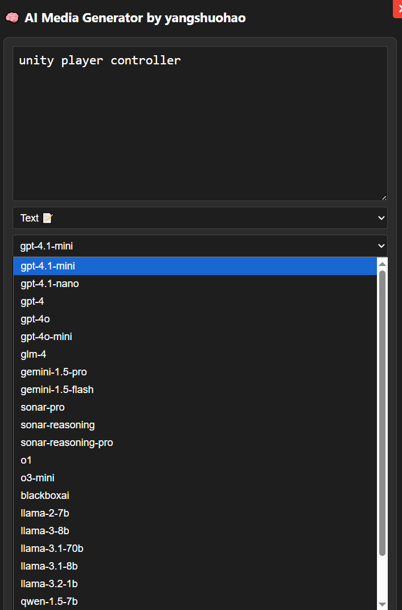
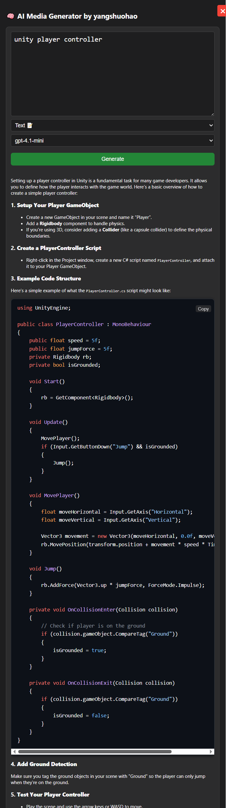
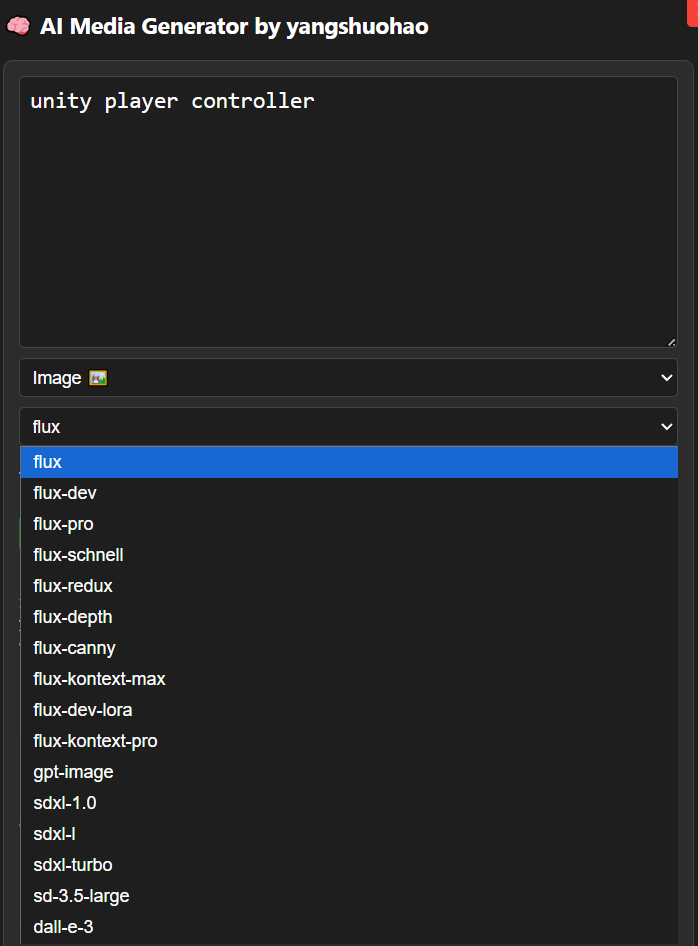
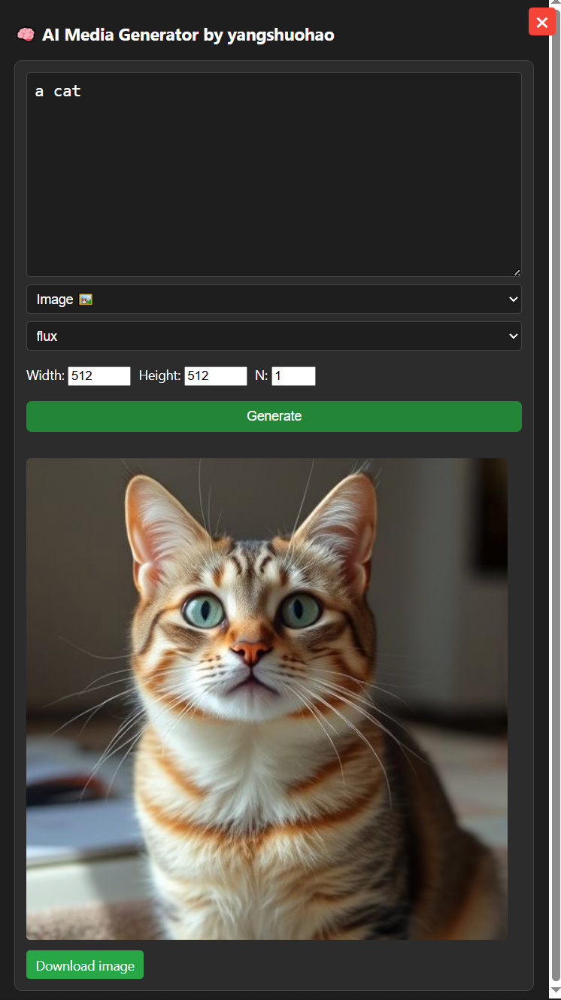

# AI Media Generator - Chrome Extension

**AI Media Generator** is a free and open-source Google Chrome extension that brings powerful AI capabilities right into your browser. It supports natural language dialogue and text-to-image generation, all from a sleek and user-friendly sidebar interface.

## 🎬 Usage Demo
 
 
 
 

## ✨ Features

- 🧠 **AI Chat** – Ask questions, brainstorm ideas, or chat with an AI assistant directly from any webpage.
- 🎨 **Text-to-Image Generation** – Turn your ideas into stunning images using AI-powered image generation.
- 🌙 **Dark/Light Theme Support** – Automatically adapts to your system theme.
- ⚙️ **Customizable Models** – Choose from multiple available models (where supported).
- 🔒 **Free to Use** – No API key required, built on free and public AI endpoints.

## 📦 Installation

1. Clone or download this repository.
2. Go to `chrome://extensions/` in your browser.
3. Enable **Developer mode** (top right).
4. Click **"Load unpacked"** and select the extension folder.

## 🚀 Get Started

Once installed, click the plugin icon in your Chrome toolbar to open the sidebar interface. You can:
- Start a conversation with the AI
- Enter a prompt to generate an image
- Copy, save, or use the results immediately

## 📄 License

This project is licensed under the [MIT License](LICENSE).

---

> AI Media Generator is completely open-source and designed to help creators, developers, and curious minds unlock the power of AI right from their browser.

## 💰 Support This Project

If you find this project helpful, consider sponsoring or treating me a coffee ☕:

### 🧧 Donate via Chinese Payment (国内用户可扫码打赏)

  
  

### 🌍 International Support

- [💸 Donate via PayPal](https://paypal.me/yangshuohao?country.x=C2&locale.x=zh_XC)

> Thank you for your support!